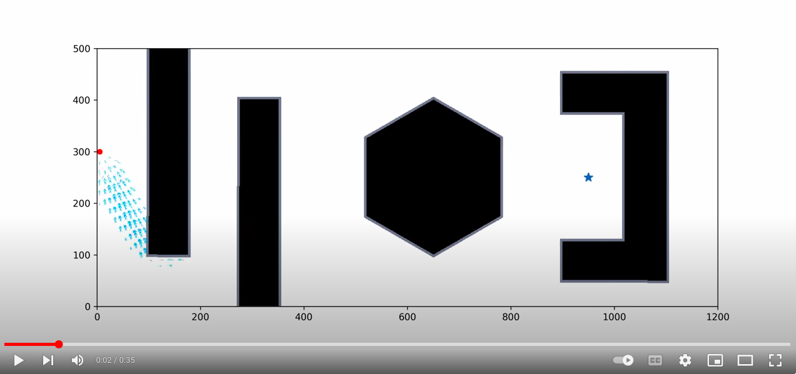
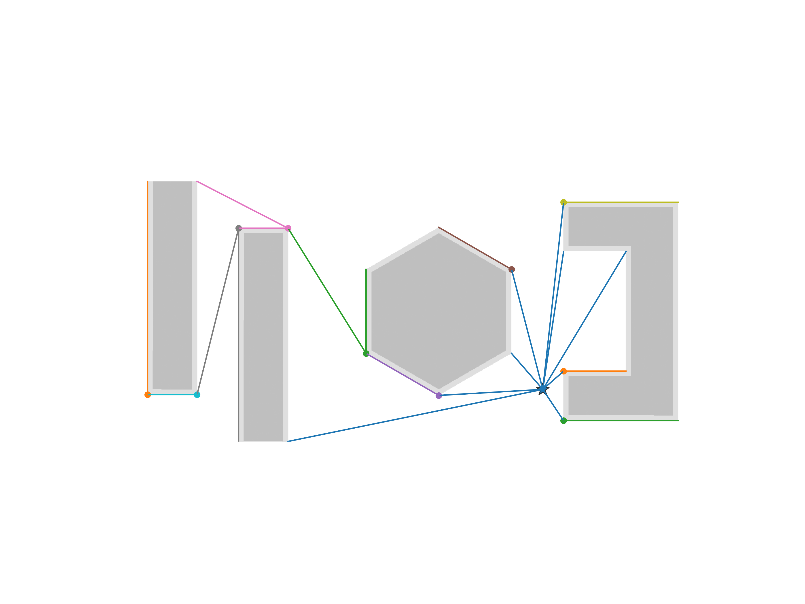
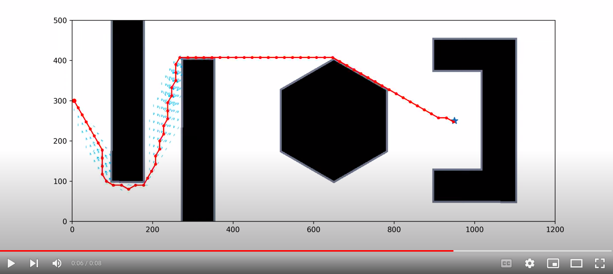

# A* search

In this project, we implemented A* search for path planning involving a robot whose action sets include a step size between 10 and 50 and a predefined range of rotation between -60 degrees and 60 degrees with a step size of 30.

## Cost to Go with Visibility Tree
The conventional choice of cost-to-go heuristics in A* search is simply the Euclidean distance between the node being explored and the goal distance. However, given the presence of obstacles, this approach might be highly inefficient. Imagine two points (A and B) separated by a wall, the aforementioned heuristics will explore the points right in front of the wall connecting A and B, which is not helpful in finding the path around the wall. Thus, we need a better way of defining the cost-to-go heuristics in the presence of obstacles. To do so, we relied on our custom-defined ***Visibility Tree***. This tree uses the goal node as the root node, and tries to connect the corners of the obstacles that are directly visible to the root (see the figure below, where the goal node is marked by the blue star, and the obstacle corners directly visible are connected with blue lines). From these visible corners, the same process is repeated until all corners are incorporated into the tree. The distance of each of the corner node in the tree can be easily found by tracing its path back to the root. For each coordinate in the free space, we can use the tree as a roadmap by connecting the coordinate in question with a node in the tree that is directly visible from the coordinate and results in the minimum distance to the goal. This value is then used as the cost-to-go estimate in our implementation. This approach readily directs the robot to search the path that allows it to go around the corners towards the goal.

By default, for any location on the map, the search of the node in the tree to connect to requires search from the root. However, this can be slow because the search requires implementing a separate priority queue. In our implementation, we only do this for the initial location, for all subsequent locations being searched, we keep track of which visibility tree node the parent location is connected to. This tree node will always be visible for all the locations reachable from the parent location. But we can do better if the parent visibility tree node is directly visible, and thus we iteratively check for that so the current location being explored can be connected to a visibility tree node even closer to the goal. Using this approach, we avoided search from the root node each time, which sped up the process.

We also found the the search can be sped up significantly if we inflate the cost-to-go slightly by multiplying it with a coefficient such as 1.05 (***weighted A****), which produces similar paths as the ones generated using a coefficient of 1.0. 

The following video shows the performance of the weighted A* search, which produces the solution much faster as it favors exploring nodes closer to the goal. 

